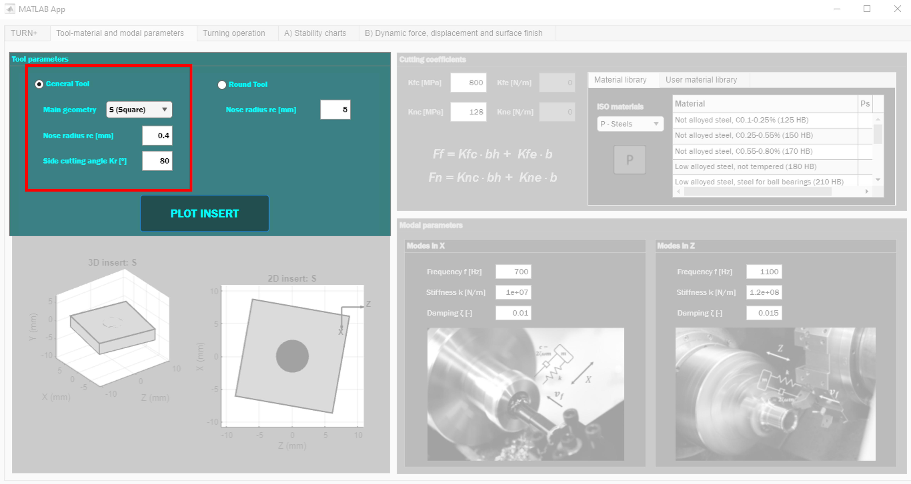
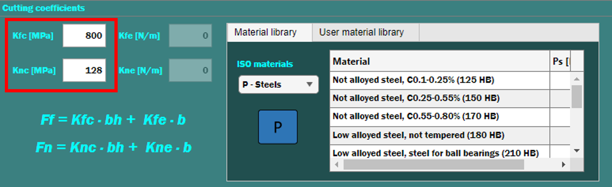
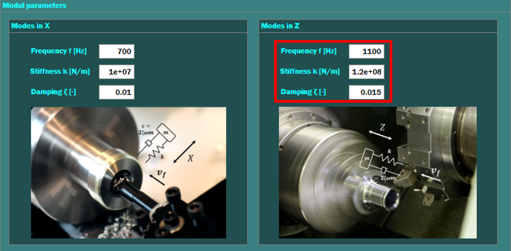
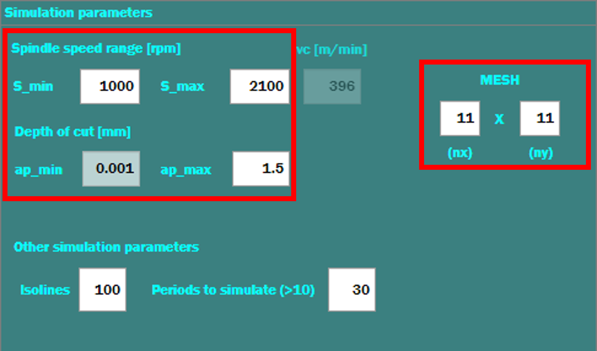
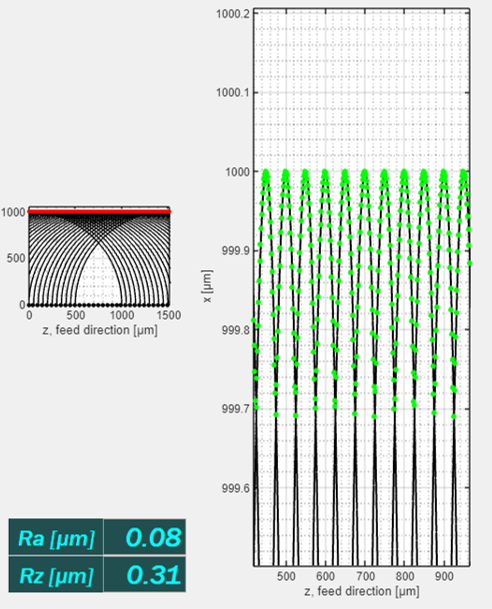

# Turn+ Tutorial — Reproducing the Case Study

This step-by-step tutorial shows how to reproduce the **Turn+** case study from the paper: compute **stability-gradient maps** and then run a single-point **time-domain simulation** to obtain **forces, displacements,** and **surface roughness (Ra, Rz)**.

## 0) Prerequisites
- Install **MATLAB Runtime R2023b** (or open the app from source in MATLAB R2023b+).
- Download and launch the packaged **Turn+** application.

---

## 1) Tool–material & modal parameters
Use this tab to define insert geometry, cutting coefficients and machine-tool modes.

### 1.1 Insert geometry
Choose the insert **shape** and **angles**, then set the **nose radius**.

*Example inputs used in the paper:* S (square) insert, nose radius **rε = 0.4 mm**, side-cutting-edge angle **κr = 80°**.

### 1.2 Cutting coefficients (Material library)
Pick a material to auto-fill **Kfc**, **Knc** or type them directly.

*Example:* **Kfc = 800 MPa**, **Knc = 128 MPa** (steel preset).

### 1.3 Modal parameters
Enter the modal data for the axis relevant to your operation: **Z** for external turning, **X** for boring.

*Example:* Z-mode: **fn = 1100 Hz**, **ζ = 0.01**, **k = 1.2×10^8 N/m**; X-mode: **fn = 700 Hz**, **ζ = 0.01**, **k = 1.2×10^8 N/m**.

---

## 2) Turning operation — define the sweep window
Select the operation type, set nominal cutting data, and define the sweep window for the stability map.

### 2.1 Select turning type
Choose **External turning** or **Internal turning (boring)**.

### 2.2 Simulation parameters
Specify the window and resolution used by the stability sweep.

*Example window:* **n = 1800–2000 rpm**, **ap = 0.5–5.0 mm**, **mesh = 11×11**.  
Set **Isolines = 100**, **Periods to simulate = 30**. Click **RUN** (see right controls).

---

## 3) A) Stability charts — interpret the results
The left panel is a colour map of **peak-to-peak dynamic cutting force**; dark blue is stable. The right panel overlays **MRR**, **power**, and **displacement** isolines.

**Heatmap (left).**

**Overlay map (right).**

Use these maps to pick a candidate point in the stable region for the time-domain run.

---

## 4) B) Dynamic force, displacement & surface finish — single-point run
Fix one operating point and compute the time histories and reconstructed surface.

### 4.1 Force and displacement histories
Top-left: force; bottom-left: displacement. Both decay to steady state in the stable case.

### 4.2 Surface reconstruction
Centre-right: envelope/profile derived from the tool-nose path.

Right: input panel used for the single-point simulation.

### 4.3 Roughness results
The **Ra** / **Rz** values are computed from the envelope.

*Example inputs:* **f = 0.05 mm/rev**, **ap = 1.0 mm**, **n = 1500 rpm**, **Periods = 30**.

---

## Tips
- External turning uses the **Z**-mode; boring uses the **X**-mode. Ensure the modal set matches the operation.
- If the stability map looks uniformly blue, widen **ap** or **n** ranges; if it saturates, reduce the range.
- For finer visualisation, increase **mesh** after you identify the region of interest.
- If time traces show excessive ripple, reduce **Δt** (Settings) or increase **Periods**.

---

## Reproduce the paper figures
- **Figure 3:** stability sweep with the window above.  
- **Figure 4:** time-domain run at **n = 1500 rpm**, **ap = 2.5 mm**, **f = 0.05 mm/rev**.

---

## Contact & issues
If you encounter problems, please open a GitHub issue with your OS, MATLAB Runtime version, and a screenshot of the settings panel.
